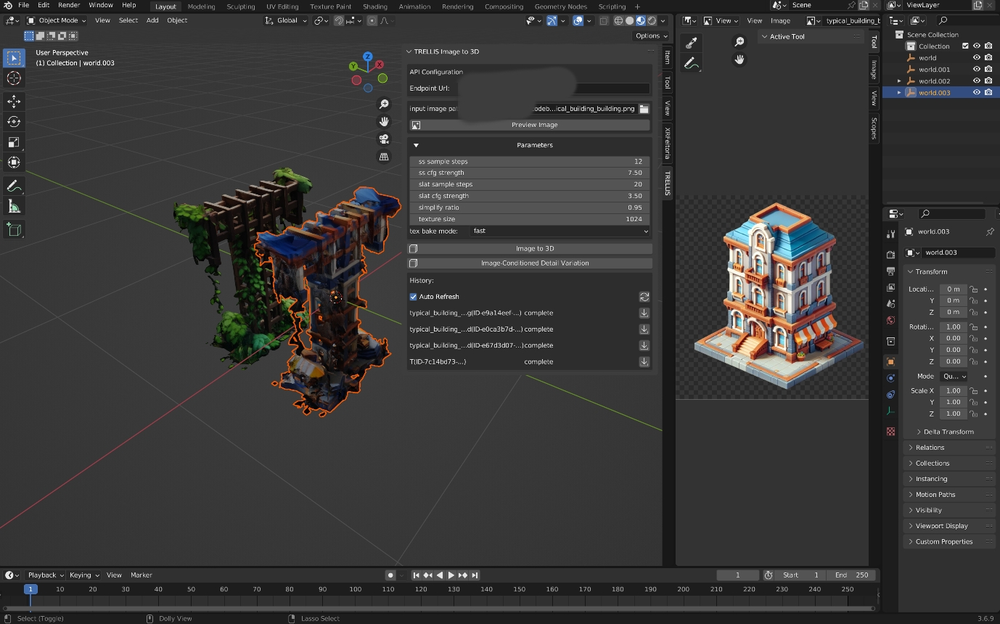

# TRELLIS Blender Plugin

A Blender addon that integrates TRELLIS's image-to-3D generation capabilities directly into Blender.

## Installation

### Requirements
- Blender 3.6.0 or higher
- Running TRELLIS API server (Refer to [my TreLLIS fork](https://github.com/FishWoWater/TRELLIS/blob/dev/README_api.md))

### Steps
1. Download the plugin files
2. In Blender, go to Edit > Preferences > Add-ons
3. Click "Install" and select the `trellis_for_blender.py` file
4. Enable the addon by checking the box next to "3D View: TRELLIS Image to 3D"

## Features

### 1. API Configuration
- Configure the API endpoint URL in the addon preferences
- Default: `http://localhost:5000`

### 2. Image Processing
- Select and preview input images
- Support for common image formats (PNG, JPG, etc.)
- Built-in image preview functionality

### 3. Generation Parameters
- **Sparse Structure Settings**
  - Sample Steps 
  - CFG Strength 
- **Structured Latent Settings**
  - Sample Steps 
  - CFG Strength 
- **Mesh Options**
  - Simplify Ratio
  - Texture Size
  - Texture Bake Mode

### 4. Generation Controls
- Image to 3D conversion

- Image-Conditioned Detail Variation
(selected an object and input an image, the image will be used to synthesize textures)

## Usage

1. **Access the Panel**
   - Open the 3D Viewport
   - Press N to open the sidebar
   - Find the TRELLIS tab

2. **Basic Workflow**
   1. Configure API URL if needed
   2. Select an input image
   3. Preview the image (optional)
   4. Adjust generation parameters
   5. Click "Image to 3D" to start generation
   6. Monitor progress in the History section
   7. Import completed models directly into your scene

3. **Request Management**
   - Enable auto-refresh for automatic status updates
   - View request history with status indicators
   - Import completed models with one click
   - Each request shows the image name and a unique identifier

## Error Handling

Common error messages and solutions:
- "No selected file": Select an input image
- "API connection error": Check if the API server is running
- "Processing error": Check the API server logs for details

## Implementation Details

The plugin provides:
- Seamless integration with Blender's UI
- Asynchronous request processing
- Real-time status updates
- Direct model importing
- Support for both single image and detail variation modes
